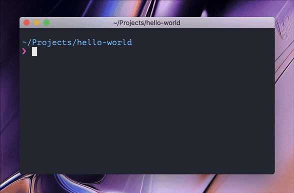

# create-pastel-app [](https://travis-ci.com/vadimdemedes/create-pastel-app)

> Generate a starter [Pastel](https://github.com/vadimdemedes/pastel) app


## Usage

This helper tool scaffolds out basic project structure for Pastel apps and lets you avoid the boilerplate and get to building beautiful CLIs in no time.

```bash
$ mkdir my-fancy-cli
$ cd my-fancy-cli
$ npx create-pastel-app
```




## License

MIT © [Vadim Demedes](https://vadimdemedes.com)
